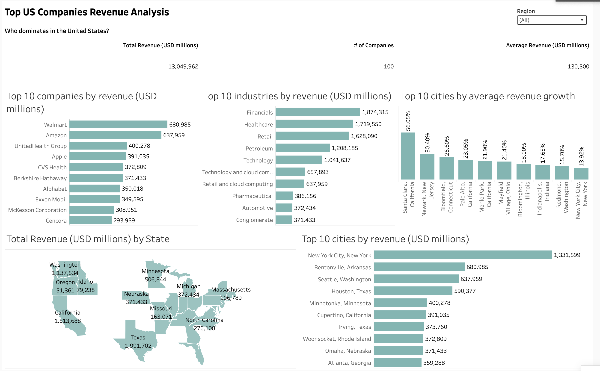

# US Company Revenue Rankings

Analysis of the 100 largest U.S. companies ranked by revenue with automated web scraping and visualization.



## 📌 Project Overview

This is a Python-based data collection project that scrapes and analyzes financial data on the largest companies in the United States by revenue. The project extracts structured data from Wikipedia, cleanses it, and provides ready to analyze datasets along with visualizations.

The dataset currently contains **100 organizations** with detailed information including:
- Company ranking by revenue
- Revenue figures (in USD millions)
- Year-over-year revenue growth
- Employee count
- Industry classification
- Headquarters location

## 🚀 Features

- **Automated Web Scraping**: Retrieves real-world financial data from Wikipedia using Python
- **Data Extraction**: Parses structured tables using BeautifulSoup
- **Data Cleaning**: Transforms raw data into clean, analysis ready format
- **CSV Export**: Outputs processed data in standard CSV format for easy integration
- **Visualization**: Includes dashboard for visual analysis of revenue rankings

## 🛠️ Tech Stack

- **Python 3.12**
- **BeautifulSoup** - HTML parsing and web scraping
- **Requests** - HTTP library for fetching web pages
- **Tableau** - Data visualization
- **Jupyter Notebook** - Interactive data exploration

## 📊 Dataset

**File**: `data/us_companies_by_revenue.csv`

**Columns**:
- `Rank` - Company ranking by revenue
- `Name` - Company name
- `Industry` - Industry classification
- `Revenue (USD millions)` - Annual revenue in millions USD
- `Revenue growth` - Year over year revenue growth percentage
- `Employees` - Total employee count
- `Headquarters` - Company headquarters location

**Sample Data** (top 5 companies):
1. Walmart - $680,985M (Retail)
2. Amazon - $637,959M (Retail and cloud computing)
3. UnitedHealth Group - $400,278M (Healthcare)
4. Apple - $391,035M (Technology)
5. CVS Health - $372,809M (Healthcare)

## 💾 Project Structure

```
├── README.md                          # Project documentation
├── LICENSE                            # Project license
├── data/
│   └── us_companies_by_revenue.csv   # Processed dataset (100 companies)
├── src/
│   └── webscrapping_companies.ipynb  # Web scraping notebook
└── visuals/
    └── US_Companies_Revenue_Rankings_Dashboard.png  # Dashboard visualization
```

## 🚀 Getting Started

### Prerequisites

- Python 3.7 or higher
- pip package manager

### Installation

1. Clone the repository:
```bash
git clone <repository-url>
cd US_Company_Revenue_Rankings
```

2. Install required dependencies:
```bash
pip install requests beautifulsoup4 pandas jupyter
```

Or using a requirements.txt file:
```bash
pip install -r requirements.txt
```

### Usage

#### Option 1: Use the Pre-processed Data
The CSV file is already available at `data/us_companies_by_revenue.csv` and ready for analysis.

#### Option 2: Re-run the Web Scraper
1. Open the Jupyter notebook:
```bash
jupyter notebook src/webscrapping_companies.ipynb
```

2. Run all cells to:
   - Scrape the latest data from Wikipedia
   - Clean and transform the data
   - Export to CSV

## 📊 Example Use Cases

- 📈 **Financial Analysis**: Identify trends in top company revenues across industries
- 🏢 **Competitive Intelligence**: Compare company sizes and market positions
- 📊 **Dashboard Building**: Create interactive visualizations of revenue rankings
- 🔍 **Market Research**: Track changes in company rankings over time
- 💼 **Business Intelligence**: Analyze revenue growth rates by sector

## 💡 Key Insights & Recommendations

### Market Overview
- **Total Combined Revenue**: $13.05 trillion across the top 100 U.S. companies
- **Average Revenue**: $130.5 billion per company
- **Market Concentration**: Top 10 companies represent a significant portion of total revenue

### 🏆 Top Performers
The "Big Three" dominate the U.S. market:
1. **Walmart** ($681B) - Retail dominance with consistent strong performance
2. **Amazon** ($638B) - High growth trajectory in retail and cloud computing
3. **UnitedHealth Group** ($400B) - Healthcare sector leadership

**Recommendation**: Monitor these market leaders for industry trends and strategic shifts, as their decisions significantly impact broader market movements.

### 🏭 Industry Insights
**Revenue Leaders by Sector:**
- **Financials** ($1.87T) - Banking and investment sector shows strength
- **Healthcare** ($1.72T) - Aging population driving sustained growth
- **Retail** ($1.63T) - E-commerce and traditional retail combined force
- **Petroleum** ($1.21T) - Energy sector maintains substantial revenue despite market changes
- **Technology** ($1.04T) - Growing but smaller than traditional sectors in this list

**Recommendation**: 
- Healthcare and Financials show exceptional resilience and growth potential
- Technology companies, while fewer in top 100, represent significant growth opportunities
- Diversify portfolio analysis across sectors to understand economic health comprehensively

### 🗺️ Geographic Concentration
**Revenue Hubs:**
- **Texas** ($1.99T) - Energy and financial headquarters
- **California** ($1.51T) - Tech and diverse industry presence
- **New York** ($1.33T) - Financial center dominance
- **Washington** ($1.14T) - Tech sector concentration (Seattle)
- **Minnesota** ($507B) - Healthcare cluster

**Recommendation**: 
- Regional economic policies significantly affect major company operations
- Geographic diversification reduces economic risk
- Consider location based investment strategies for sector specific opportunities

### 📈 Growth Opportunities
**Fastest Growing Cities by Revenue Growth Rate:**
- **Santa Clara, California** (56.05%) - Tech innovation hub
- **California region** (30.00%) - Sustained tech and business growth
- **Newark, New Jersey** (26.60%) - Healthcare industry growth
- **Bronxfield, Connecticut** (23.05%) - Financial sector expansion

**Recommendation**: 
- Emerging markets in tech hubs show exceptional growth potential
- Healthcare sector expansion indicates demographic and industry tailwinds
- Consider investing in or expanding operations in high growth regions

### 💼 Strategic Recommendations

1. **For Investors**:
   - Diversify across sectors (Financials, Healthcare, Retail, Technology)
   - Monitor the top 10 companies for market signals
   - Watch high growth regional clusters (California tech, Texas energy)

2. **For Business Development**:
   - Identify partnership opportunities with companies in high growth cities
   - Consider expansion into underrepresented regions
   - Target emerging industries showing upward growth trends

3. **For Market Analysts**:
   - Track revenue growth rates as leading indicators of economic health
   - Monitor industry composition changes quarter over quarter
   - Analyze geographic revenue shifts for regional economic insights

4. **For Competitive Intelligence**:
   - Benchmark against peers in the same industry and geographic region
   - Track top performers' strategic initiatives and market entries
   - Identify gaps where new competitors could emerge

## 📝 License

This project is licensed under the terms specified in the [LICENSE](LICENSE) file.

## 🤝 Contributing

Contributions are welcome! Feel free to:
- Report issues or bugs
- Suggest improvements or new features
- Submit pull requests with enhancements

## ⚠️ Data Source Disclaimer

This dataset is compiled from publicly available information on Wikipedia. The data reflects the most recent information available at the time of scraping and may differ from official company filings. Please verify critical data with primary sources. 
